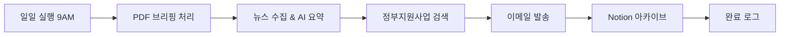

# Hyscape 수소 산업 자동화 시스템


> 수소 산업 뉴스 브리핑, 정부지원사업 추천, Notion 아카이브 통합 자동화 시스템

---

## 📋 프로젝트 개요

Hyscape의 수소 산업 정보 수집 및 분석을 자동화하는 통합 시스템입니다.

### 🎯 주요 기능

1. **📰 일일 뉴스 브리핑**
   - 수소 산업 뉴스 자동 수집 및 AI 요약
   - 맞춤형 HTML 이메일 발송
   - PDF 브리핑 자동 처리

2. **🏛️ 정부지원사업 추천**
   - K-Startup, IRIS, 기업마당 크롤링
   - 기술/자격 키워드 기반 필터링
   - 관련 공고 자동 추천

3. **📚 Notion 아카이브**
   - PDF 브리핑 자동 업로드
   - AI 기반 감성 분석 및 카테고리 분류
   - 키워드 자동 추출

4. **⏰ 자동 스케줄링**
   - Windows 작업 스케줄러 통합
   - 평일 오전 9시 자동 실행

---

## 🏗️ 프로젝트 구조

```
2025F_HYSCAPE/
│
├── hyscape_daily_automation/     # 🚀 프로덕션 시스템 (통합 버전)
│   ├── main_unified.py           # 통합 실행 스크립트
│   ├── config_production.py      # 메인 설정 (환경변수 사용)
│   ├── notion_config_production.py  # Notion 설정
│   ├── .env                      # 크리덴셜 (gitignore됨)
│   ├── .env.template             # 환경변수 템플릿
│   │
│   ├── modules/                  # 모듈 어댑터
│   │   ├── news_briefing.py      # 뉴스 브리핑 모듈
│   │   ├── gov_support.py        # 정부지원사업 모듈
│   │   └── notion_archive.py     # Notion 아카이브 모듈
│   │
│   ├── shared/                   # 공유 유틸리티
│   │   ├── pdf_analyzer.py       # PDF 분석
│   │   └── gemini_client.py      # Gemini AI 클라이언트
│   │
│   ├── dependencies/             # 기존 시스템 복사본
│   │
│   ├── RUN_autobriefing.bat      # 일괄 실행 스크립트
│   ├── SETUP_schedule.bat        # 자동 스케줄 설정
│   ├── REMOVE_schedule.bat       # 스케줄 제거
│   └── README_operation_guide.md # 운영 가이드
│
├── mail_version9/                # 뉴스 브리핑 시스템
├── government_version2/          # 정부지원사업 크롤러
├── notion_version3/              # Notion 업로더
├── experiment_version1/          # 실험 및 분석 (아카이브)
│
├── project_archive/              # 이전 버전 아카이브
│
├── SECURITY_NOTICE.md            # 보안 가이드
├── SECURITY_AUDIT_REPORT.md      # 보안 감사 보고서
├── COMPREHENSIVE_SECURITY_AUDIT.md  # 종합 보안 감사
│
└── README.md                     # 이 파일
```

---

## 🚀 빠른 시작

### 1. 프로덕션 시스템 사용 (권장)

```bash
cd hyscape_daily_automation

# 1. 환경 변수 설정
cp .env.template .env
# .env 파일을 편집하여 실제 크리덴셜 입력

# 2. 실행
# Windows:
RUN_autobriefing.bat

# Linux/WSL:
/path/to/venv/bin/python main_unified.py
```

### 2. 자동 스케줄 설정 (Windows)

```bash
# 관리자 권한으로 실행
SETUP_schedule.bat

# 평일 오전 9시에 자동 실행됨
```

자세한 내용은 [`hyscape_daily_automation/README_operation_guide.md`](hyscape_daily_automation/README_operation_guide.md) 참고

---

## ⚙️ 환경 설정

### 필수 요구사항

- **Python**: 3.8 이상
- **OS**: Windows 10/11 또는 Linux (WSL 지원)
- **인터넷**: API 및 크롤링용

### API 키 발급

1. **Google Gemini API**
   - https://aistudio.google.com/app/apikey
   - 무료 할당량 사용 가능

2. **Gmail 앱 비밀번호**
   - https://myaccount.google.com/apppasswords
   - 2단계 인증 필요

3. **Notion API** (선택사항)
   - https://www.notion.so/my-integrations
   - 데이터베이스 연동 시 필요

### 환경 변수 설정 (.env)

```bash
# Google Gemini AI
GOOGLE_API_KEY=your_google_api_key_here
GEMINI_MODEL=gemini-2.0-flash

# Gmail SMTP
SENDER_EMAIL=your_email@gmail.com
SENDER_PASSWORD=your_16_char_app_password

# Notion API (선택)
NOTION_API_TOKEN=your_notion_token_here
NOTION_DATABASE_ID=your_database_id_here
```

> ⚠️ **중요**: `.env` 파일은 절대 Git에 커밋하지 마세요!

---

## 📊 시스템 워크플로우



### 실행 순서

1. **PDF 브리핑 분석**: pdf/ 폴더의 PDF 파일 처리
2. **뉴스 브리핑 수집**: RSS, 웹크롤링, 네이버/구글 검색
3. **AI 요약 생성**: Gemini AI로 핵심 내용 추출
4. **정부지원사업 추천**: 관련 공고 필터링
5. **이메일 발송**: HTML 형식 브리핑 전송
6. **Notion 업로드**: 분석 결과 아카이브

---

## 🔧 주요 설정

### Target 키워드 (config_production.py)

```python
# 기술 키워드
TARGET_KEYWORDS_TECH = [
    "PEM 수전해", "AEM 수전해", "연료전지",
    "촉매", "전해질막", "그린수소", "청정수소",
    "재생에너지", "탄소중립"
]

# 수집 제한
MAX_ARTICLES_PER_SOURCE = 3
MAX_TOTAL_ARTICLES = 5
```

### 필터링 전략 (config_production.yaml)

```yaml
filter_strategies:
  type_a:  # 기술 중심 (IRIS용)
    logic: "tech_keywords_required"

  type_b:  # 지원 중심 (K-Startup용)
    logic: "tech_or_support_and_qualification"

keywords:
  tech: ["수소", "연료전지", "수전해", ...]
  support: ["마케팅", "수출", "R&D", ...]
  qualification: ["성남", "중소기업", ...]
```

---

## 📝 로그 및 모니터링

### 로그 파일

- **통합 로그**: `hyscape_daily_automation/logs/unified_automation.log`
- **실패한 소스**: `mail_version9/logs/failed_sources.txt`

### 로그 형식

```
2025-12-18 09:00:00 - news_briefing - INFO - 뉴스 브리핑 시작
2025-12-18 09:00:05 - news_briefing - INFO - ✓ 5개 기사 수집 완료
2025-12-18 09:00:10 - gov_support - INFO - ✓ 정부지원사업 3건 추천
```

---

## 🔐 보안

### Git Repository

- ✅ 모든 민감한 정보 제거 완료
- ✅ `.gitignore`로 크리덴셜 보호
- ✅ 정기 보안 감사 실시

### 로컬 파일

- `.env` 파일에 모든 크리덴셜 저장
- config 파일은 환경변수만 참조
- 정기적인 비밀번호 순환 권장

자세한 내용은 [`SECURITY_NOTICE.md`](SECURITY_NOTICE.md) 참고

---

## 🛠️ 문제 해결

### Q: 이메일 발송 실패

**해결**: `.env` 파일의 Gmail 앱 비밀번호 확인

### Q: API 키 오류

**해결**: Gemini API 키 유효성 및 할당량 확인

### Q: PDF 처리 실패

**해결**: PDF 파일명 형식 확인 (YYMMDD_title.pdf)

### Q: 정부지원사업 크롤링 실패

**해결**: 웹사이트 구조 변경 가능성 - 스크래퍼 업데이트 필요

더 많은 문제 해결은 [`hyscape_daily_automation/README_operation_guide.md`](hyscape_daily_automation/README_operation_guide.md) 참고

---

## 📦 기술 스택

### Core

- **Python 3.8+**
- **Google Gemini AI**: 텍스트 요약 및 분석
- **BeautifulSoup4**: 웹 크롤링
- **Feedparser**: RSS 피드 파싱

### Infrastructure

- **Windows Task Scheduler**: 자동 실행
- **WSL**: Linux 호환성
- **Git**: 버전 관리

### APIs & Services

- **Gmail SMTP**: 이메일 발송
- **Notion API**: 데이터베이스 연동
- **Naver/Google Search**: 뉴스 검색

---

## 📈 버전 히스토리

### v1.0 (2025-12-17) - 통합 시스템
- ✅ mail_version9, government_version2, notion_version3 통합
- ✅ 프로덕션 크리덴셜 설정
- ✅ 원클릭 실행 스크립트
- ✅ 포괄적인 에러 격리

### v1.1 (2025-12-18) - 자동화 및 보안
- ✅ Windows 작업 스케줄러 통합
- ✅ 보안 감사 및 Git History 정리
- ✅ 종합 보안 문서화
- ✅ 개인정보 완전 제거

---

## 🔄 자동화 (Windows Task Scheduler)

### 자동 스케줄 설정

```bash
# 관리자 권한으로 실행
cd hyscape_daily_automation
SETUP_schedule.bat
```

### 스케줄 제거

```bash
REMOVE_schedule.bat
```

### 수동 확인

- 작업 스케줄러 → 작업 스케줄러 라이브러리
- 작업 이름: **Hyscape_Daily_Briefing**
- 실행 시간: 평일 오전 9:00

---

## 📚 문서

- **운영 가이드**: [`hyscape_daily_automation/README_operation_guide.md`](hyscape_daily_automation/README_operation_guide.md)
- **보안 가이드**: [`SECURITY_NOTICE.md`](SECURITY_NOTICE.md)
- **보안 감사 보고서**: [`COMPREHENSIVE_SECURITY_AUDIT.md`](COMPREHENSIVE_SECURITY_AUDIT.md)
- **배포 가이드**: [`hyscape_daily_automation/WINDOWS_DEPLOYMENT.md`](hyscape_daily_automation/WINDOWS_DEPLOYMENT.md)

---

## 🎯 향후 개발 계획

### 단기 (1개월)
- [ ] 웹 대시보드 개발
- [ ] 데이터베이스 연동 (중복 방지)
- [ ] 추가 정부지원사업 사이트 크롤러

### 중기 (3개월)
- [ ] 머신러닝 기반 추천 시스템
- [ ] 실시간 알림 기능
- [ ] API 서버 구축

### 장기 (6개월)
- [ ] 다국어 지원
- [ ] 모바일 앱 개발
- [ ] 클라우드 배포 (AWS/GCP)

---

## 🤝 기여

이 프로젝트는 Hyscape 내부 프로젝트입니다.

### 개발 프로세스

1. 기능 브랜치 생성
2. 코드 작성 및 테스트
3. Pull Request 생성
4. 코드 리뷰 및 병합

---

## 📄 라이선스

MIT License

Copyright (c) 2025 Hyscape

---

## 📞 문의

- **개발팀**: Hyscape 기술개발팀
- **이메일**: Contact via internal channels

---

## ⚠️ 주의사항

1. **크리덴셜 보안**
   - `.env` 파일은 절대 Git에 커밋하지 마세요
   - 정기적으로 비밀번호를 변경하세요
   - API 키 사용량을 모니터링하세요

2. **데이터 처리**
   - 개인정보 수집/저장 최소화
   - 로그 파일 정기 삭제
   - 데이터 보안 정책 준수

3. **시스템 운영**
   - 정기적인 의존성 업데이트
   - 백업 정책 수립
   - 에러 로그 모니터링

---

**제작**: Hyscape 인턴십 프로젝트
**버전**: 1.1
**최종 업데이트**: 2025-12-18
